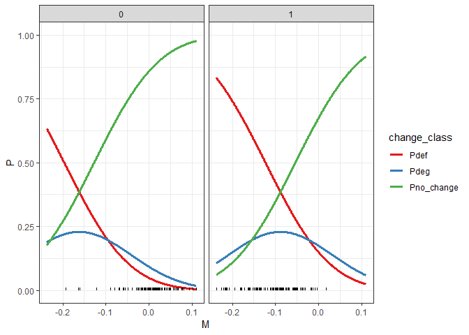

Forest Change Models
====================

This repository contains data and code for the paper:

DeVries, B., Verbesselt, J., Kooistra L. and Herold, M. 2015. Robust
monitoring of small-scale forest disturbances in a tropical montane
forest using Landsat time series. Remote Sensing of Environment,
161:107-121,
[doi:10.1016/j.rse.2015.02.012](https://doi.org/10.1016/j.rse.2015.02.012)

This paper describes an implementation of the `bfastmonitor` method with
Landsat NDVI time series for tracking small-scale forest disturbances in
a montane forest in southwestern Ethiopia.

## 1. Cal/Val data

Calibration and validation data were generated using visual
interpretation of very high resolution (VHR) SPOT5 and RapidEye imagery.
Together, these data formed an annual time series from 2006 to 2012 over
the study area. Using the
[timeSyncR](https://github.com/bendv/timeSyncR) package, randomly
sampled pixels were labeled as "deforestation", "degradation" or
"no-change" depending on the changes to the forest canopy observed in
the VHR time series.

    ref <- read.csv('data/OLR_refdata.csv', row.names = 1)
    # convert breakpoints from numeric to factor
    ref$breakpoint <- factor(ref$breakpoint)
    head(ref)

The `change_class` column contains the change labels assigned during VHR
image interpretation. The `breakpoint` column indicates whether
`bfastmonitor` breakpoints occurred (1) or did not occur (0) for that
particular pixel. The `magnitude` columns indicates the NDVI change
magnitude (ie., the median residual) for that pixel within the 1-year
monitoring period window where the breakpoint was detected.

## 2. Ordinal Logistic Regression

Ordinal logistic regression (OLR) was used to test the ability of the
`bfastmonitor` breakpoint-magnitude indicators to predict deforestation
(complete remove of the forest canopy) and degradation (partial removal
of the forest canopy). In this study, OLR models were tested using the
change class - deforestation, degradation or no-change - as the response
variable and several combinations of breakpoints (binary) and magnitude
(continuous) as predictor variables. OLR's are fit using the `polr()`
command in the `MASS` library.

    library(MASS)
    m0 <- polr(change_class ~ 1, data = ref, method = "probit", Hess = TRUE)  # null model
    m1 <- polr(change_class ~ magnitude, data = ref, method = "probit", Hess = TRUE)
    m2 <- polr(change_class ~ magnitude + breakpoint, data = ref, method = "probit", Hess = TRUE)
    m3 <- polr(change_class ~ breakpoint, data = ref, method = "probit", Hess = TRUE)

Here, we fit four models for testing:  
- `m0`: "Null" model (no predictor variables)  
- `m1`: magnitude as a predictor without breakpoints  
- `m2`: magnitude and breakpoints as predictors  
- `m3`: breakpoints only  
  

    aic <- AIC(m0, m1, m2, m3)
    print(aic)

Using the Aikaike Information Criterion (AIC), the model that includes
both breakpoints and magnitude as predictor variables seems to be the
most suitable of the four models, so we will continue with that model.

Next we want to see how these predictor variables affect the probability
of the three classes predicted by our model. To do this, we will predict
the class probabilities over a range of magnitude values with and
without breakpoints.

    magns <- seq(min(ref$magnitude), max(ref$magnitude), length = 500)
    nd2 <- data.frame(magnitude = rep(magns, 2), breakpoint = factor(c(rep(0, 500), rep(1, 500)), levels = c(0, 1)))
    P2 <- predict(m2, newdata = nd2, type = "probs")
    nd2$Pdef <- P2[, 1]
    nd2$Pdeg <- P2[, 2]
    nd2$Pno_change <- P2[, 3]

    head(nd2)

The columns `Pdef`, `Pdeg` and `Pno_change` represent the predicted
class probabilities by our `m2` model. We can plot these to analyze the
effects of these predictor variables on the class probabilities.

    library(ggplot2)
    library(reshape2)

    nd2m <- melt(nd2, id.vars = c("magnitude", "breakpoint"))
    names(nd2m) <- c("magnitude", "breakpoint", "change_class", "P")

    p <- ggplot(data = nd2m, aes(x = magnitude, y = P)) +
      geom_line(aes(col = change_class), size = rel(1.2)) +
      scale_y_continuous(limits = c(0, 1)) +
      facet_wrap(~ breakpoint, ncol = 2) +
      labs(x = "M") +
      scale_colour_brewer(palette = "Set1") +
      geom_segment(data = ref, aes(x = magnitude, xend = magnitude), y = 0, yend = 0.01, lwd = 0.5) +
      theme_bw()
    p

The plots indicate the effect of magnitude on the three class
probabilities without breakpoints (left) and with breakpoints (right).
The ticks at the bottom of the plot indicate the magnitude values of the
sampled pixels. From this plot we can see that even though magnitude has
an effect on the probability of detecting degradation, the probability
is never sufficiently high to assign a degradation label (the other 2
classes are always more probabable). Therefore, we concluded that using
this method, it was not possible to reliably detect degradation, which
may be due to the spatial resolution of the Landsat data, limitations in
spectral index used (NDVI), limitations in the temporal resolution of
the data, or any combination of these or other factors.

## 3. Binomial Logistic Regression

...coming soon...

